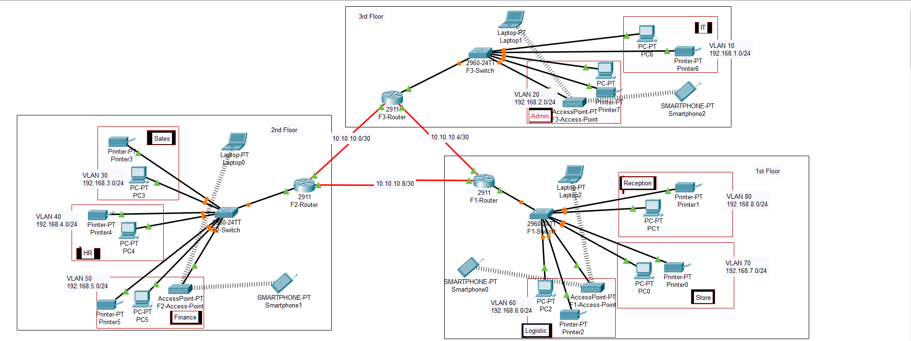

# Hotel-Ag-Tasarimi-ve-Uygulamasi

## Proje Hakkında

Bu proje, üç katlı Hotel için güvenli, ölçeklenebilir ve verimli bir ağ altyapısının tasarımı ve uygulanmasını içermektedir. Her kat farklı departmanları barındırmakta olup, VLAN segmentasyonu, dinamik yönlendirme ve güvenli uzaktan erişim gibi ileri düzey ağ uygulamaları kullanılmıştır.

## Otel Kat Planı ve Departman Dağılımı

- 1. Kat: Resepsiyon (Reception), Depo (Store), Lojistik (Logistics)
- 2. Kat: Finans (Finance), İnsan Kaynakları (HR), Satış/Pazarlama (Sales)
- 3. Kat: Bilgi Teknolojileri (IT), Yönetim (Admin)

## Ağ Tasarım Özellikleri

- **Router Yerleşimi:** Üç yönlendirici (her kat için bir adet) fiziksel olarak 3. kattaki IT departmanında bulunan sunucu odasında konumlandırılmıştır.
- **Routerlar Arası Bağlantılar:**
  - F2-Router ↔ F3-Router: 10.10.10.0/30
  - F2-Router ↔ F1-Router: 10.10.10.4/30
  - F1-Router ↔ F3-Router: 10.10.10.8/30
- **Yönlendirme Protokolü:** Tüm VLAN'lar arası iletişim için OSPF (Open Shortest Path First) dinamik yönlendirme protokolü yapılandırılmıştır.
- **VLAN Segmentasyonu:** Her departmana özel VLAN ve IP ağı atanarak ağ trafiği izole edilmiştir.
- **Kablosuz Erişim:** Her katta erişim noktaları (Access Point) ile dizüstü bilgisayarlar ve mobil cihazlar kablosuz ağa bağlanabilmektedir.
- **DHCP Sunucusu:** Her katta bulunan router, bağlı VLAN’lar için DHCP sunucusu olarak yapılandırılmıştır.
- **SSH Erişimi:** Tüm router’lara uzaktan güvenli bağlantı için SSH yapılandırılmıştır.
- **Port Güvenliği:** IT departmanında switch üzerinde port güvenliği uygulanmış, yalnızca belirli cihazların bağlantısına izin verilmiştir.

## VLAN ve IP Adresleme Şeması

| Kat       | Departman     | VLAN ID | Ağ Adresi       | Alt Ağ Maskesi     |
|-----------|----------------|---------|------------------|---------------------|
| 1. Kat    | Resepsiyon     | VLAN 80 | 192.168.8.0/24   | 255.255.255.0       |
|           | Depo           | VLAN 70 | 192.168.7.0/24   | 255.255.255.0       |
|           | Lojistik       | VLAN 60 | 192.168.6.0/24   | 255.255.255.0       |
| 2. Kat    | Finans         | VLAN 50 | 192.168.5.0/24   | 255.255.255.0       |
|           | İnsan Kaynakları| VLAN 40| 192.168.4.0/24   | 255.255.255.0       |
|           | Satış          | VLAN 30 | 192.168.3.0/24   | 255.255.255.0       |
| 3. Kat    | Yönetim        | VLAN 20 | 192.168.2.0/24   | 255.255.255.0       |
|           | BT             | VLAN 10 | 192.168.1.0/24   | 255.255.255.0       |

## Kullanılan Teknolojiler

- Cisco Packet Tracer (simülasyon ortamı)
- VLAN yapılandırması
- OSPF dinamik yönlendirme
- DHCP yapılandırması (router bazlı)
- SSH ile güvenli uzaktan erişim
- Switch üzerinde port güvenliği
- Kablosuz ağ altyapısı
- Router-on-a-Stick (tek router arayüzü üzerinden birden fazla VLAN yönetimi)

## Test ve Doğrulama

- **Bağlantı Kontrolü:** Tüm katlar ve VLAN'lar arası ping testleriyle iletişim doğrulandı.
- **DHCP Dağıtımı:** Her VLAN içerisindeki cihazlara IP dağıtımı otomatik olarak sağlandı.
- **OSPF Yönlendirme:** Routing tabloları kontrol edilerek tüm ağların başarıyla öğrenildiği doğrulandı.
- **SSH Erişimi:** IT departmanındaki Test-PC üzerinden router'lara SSH bağlantısı başarılı şekilde sağlandı.
- **Port Güvenliği Testi:** Switch üzerinde yalnızca tanımlı cihazlara izin verilerek güvenlik doğrulandı.
